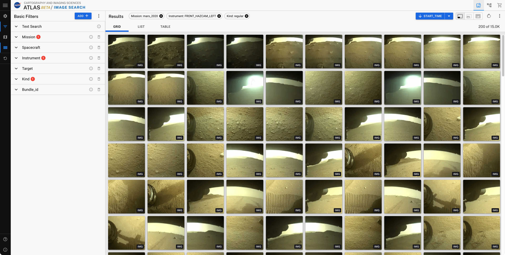
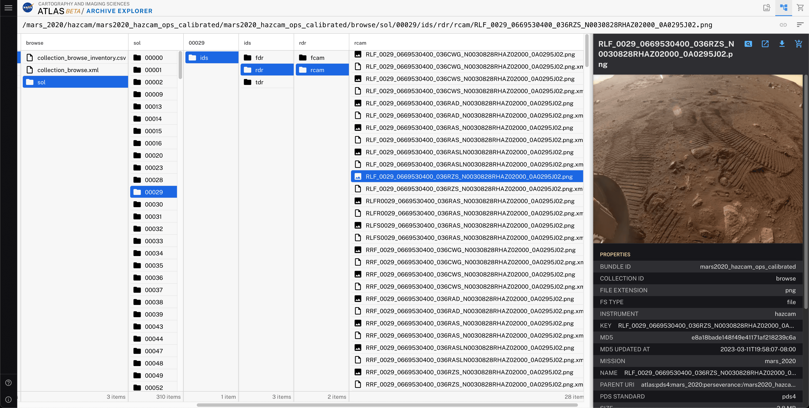

  <h1 align="center">
      Atlas IV
  </h1>

<pre align="center">The Official Image Search of the PDS Cartography and Imaging Sciences Node (PDSIMG)</pre>

## [See it LIVE!](https://pds-imaging.jpl.nasa.gov/tools/atlas/search)

## Features

- Full imagery search
- Dynamically add facets
- Spatial searches
- Advanced queries
- Image viewer
- Cart
- Bulk download queries and folders
- File system viewer
- ...

---

## Installation

### System Requirements

1. Install the latest version of [Node.js v20.13.1+](https://nodejs.org/en/download/).

### Setup

`/` will always refer to the repo's root directory

1. Clone the repo  
   `git clone https://github.com/NASA-PDS/atlas`

1. From within `/` (If deploying code, be sure to use `npm ci` to produce deterministic builds)
   `npm install`

1. Copy `/sample.env` to `.env`  
   `cp sample.env .env`

1. Run `npm run build` to bundle up the code (first time or if there are any changes)

   1. Run `npm run start:prod` for production
   1. cd `/Documentation`, `npm install`, `npm run build` to build the /documentation (served through Atlas server)

1. Or run `npm run start` for development

---

## Contributing

Check out our contributing guide [here.](CONTRIBUTING.md)

---

## Code of Conduct

Check out our code of conduct [here.](CODE_OF_CONDUCT.md)

---

### License: Apache 2.0 (https://www.apache.org/licenses/LICENSE-2.0)

Copyright (c) 2026, California Institute of Technology ("Caltech"). U.S. Government sponsorship acknowledged.

All rights reserved.

Redistribution and use in source and binary forms, with or without modification, are permitted provided that the following conditions are met:

- Redistributions of source code must retain the above copyright notice, this list of conditions and the following disclaimer.
- Redistributions must reproduce the above copyright notice, this list of conditions and the following disclaimer in the documentation and/or other materials provided with the distribution.
- Neither the name of Caltech nor its operating division, the Jet Propulsion Laboratory, nor the names of its contributors may be used to endorse or promote products derived from this software without specific prior written permission.

THIS SOFTWARE IS PROVIDED BY THE COPYRIGHT HOLDERS AND CONTRIBUTORS "AS IS" AND ANY EXPRESS OR IMPLIED WARRANTIES, INCLUDING, BUT NOT LIMITED TO, THE IMPLIED WARRANTIES OF MERCHANTABILITY AND FITNESS FOR A PARTICULAR PURPOSE ARE DISCLAIMED. IN NO EVENT SHALL THE COPYRIGHT OWNER OR CONTRIBUTORS BE LIABLE FOR ANY DIRECT, INDIRECT, INCIDENTAL, SPECIAL, EXEMPLARY, OR CONSEQUENTIAL DAMAGES (INCLUDING, BUT NOT LIMITED TO, PROCUREMENT OF SUBSTITUTE GOODS OR SERVICES; LOSS OF USE, DATA, OR PROFITS; OR BUSINESS INTERRUPTION) HOWEVER CAUSED AND ON ANY THEORY OF LIABILITY, WHETHER IN CONTRACT, STRICT LIABILITY, OR TORT (INCLUDING NEGLIGENCE OR OTHERWISE) ARISING IN ANY WAY OUT OF THE USE OF THIS SOFTWARE, EVEN IF ADVISED OF THE POSSIBILITY OF SUCH DAMAGE.

---

## Contact

pds-imaging@jpl.nasa.gov
